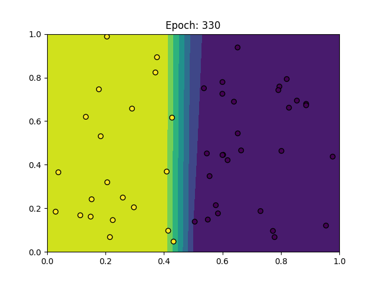
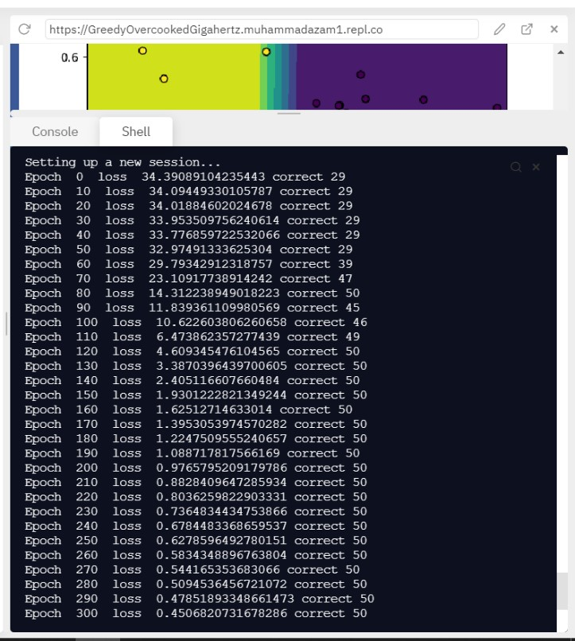
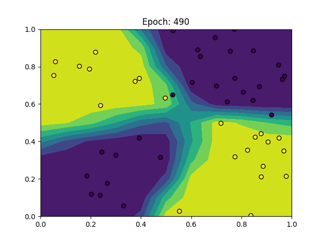
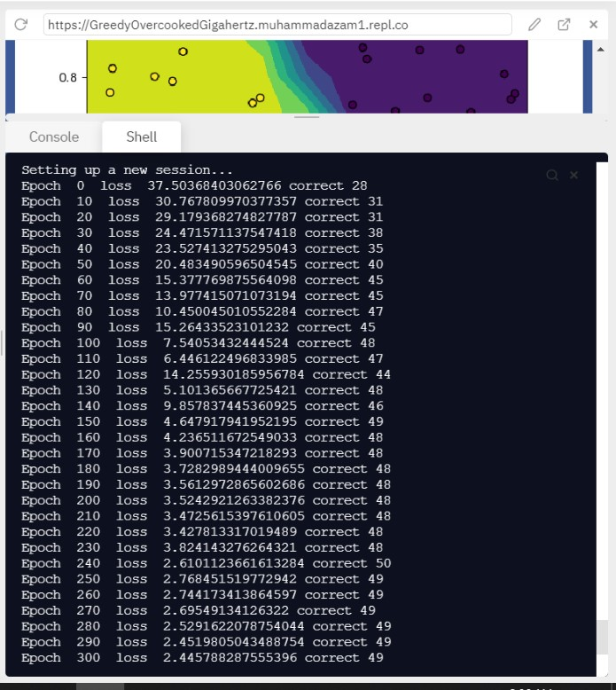

# MiniTorch Module 1  


* Docs: https://minitorch.github.io/

* Overview: https://minitorch.github.io/module1.html

This module requires `operators.py` and `module.py` from Module 0

```
cp ../Module-0/operators.py ../Module-0/module.py minitorch/
```


* Tests:

```
python run_tests.py
```

### Figures for Task 1.5:

#### Simple 





#### Xor



