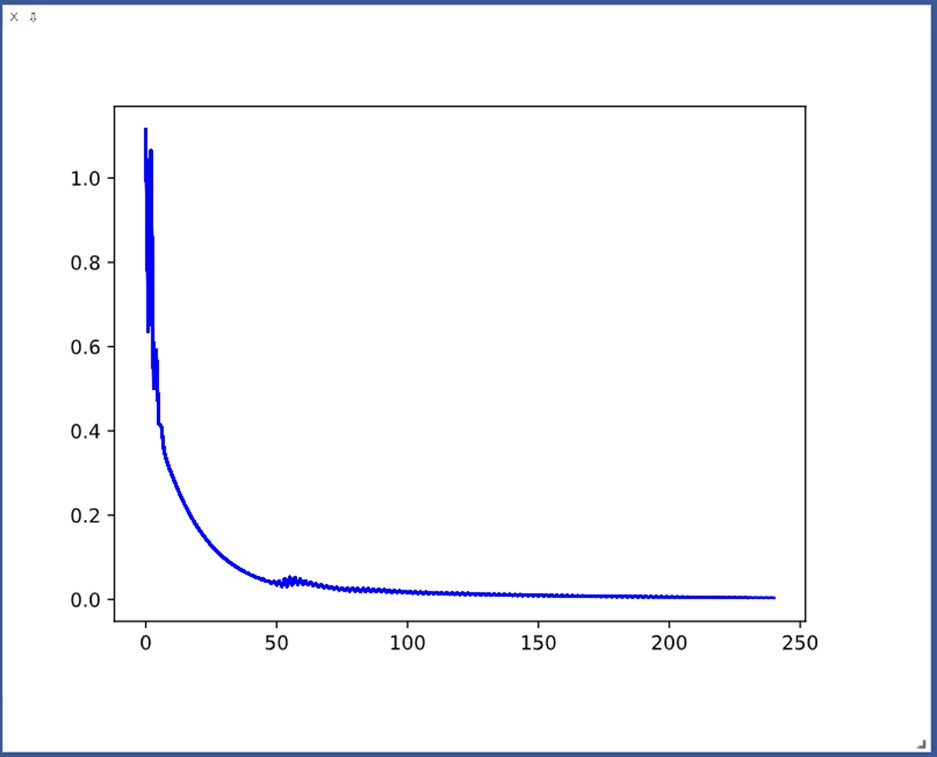
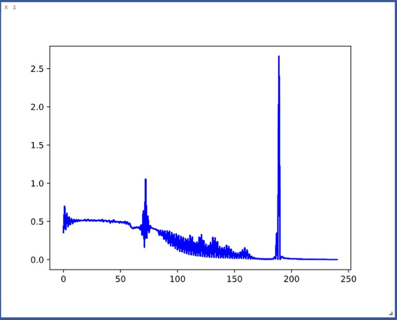
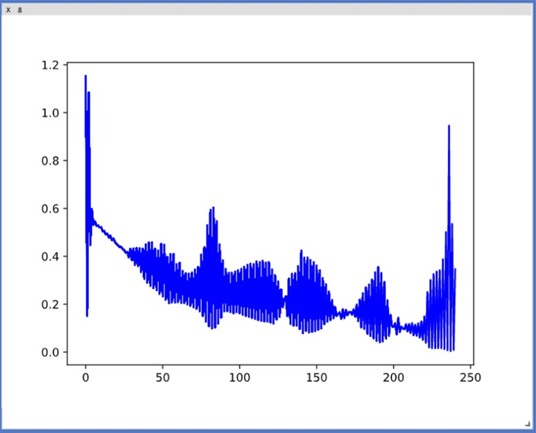

# MiniTorch Module 3


* Docs: https://minitorch.github.io/

* Overview: https://minitorch.github.io/module3.html

This module requires `scalar.py`, `tensor_functions.py`, `tensor_data.py`, `tensor_ops.py`, `operators.py`, `module.py`, and `autodiff.py` from Module 2.

You will need to modify `tensor_functions.py` slightly in this assignment.

* Tests:

```
python run_tests.py
```

* Note:

Several of the tests for this assignment will only run if you are on a GPU machine and will not
run on github's test infrastructure. Please follow the instructions to setup up a colab machine
to run these tests.

### Figures for Task 3.5:

#### Simple 

Epoch 0 loss 1.1145754065240747 correct 30 time 20.65896511077881 

Epoch 10 loss 0.2953176667568604 correct 47 time 0.030761241912841797 

Epoch 20 loss 0.16909922552631662 correct 47 time 0.025601863861083984 

Epoch 30 loss 0.09773358726826571 correct 48 time 0.03218960762023926 

Epoch 40 loss 0.058388642877260505 correct 48 time 0.02707958221435547 

Epoch 50 loss 0.034235806181559414 correct 46 time 0.025778770446777344 

Epoch 60 loss 0.03591888822413949 correct 46 time 0.026836633682250977 

Epoch 70 loss 0.02625498425034728 correct 46 time 0.025150537490844727 

Epoch 80 loss 0.01945044906544922 correct 46 time 0.02651834487915039 

Epoch 90 loss 0.01817006264416176 correct 46 time 0.02604985237121582 

Epoch 100 loss 0.015345220373167398 correct 46 time 0.0262300968170166 

Epoch 110 loss 0.01299800194944707 correct 46 time 0.027545928955078125 

Epoch 120 loss 0.01177143460569076 correct 46 time 0.0275423526763916 

Epoch 130 loss 0.010529693661860752 correct 46 time 0.025502920150756836 

Epoch 140 loss 0.009379992996011277 correct 46 time 0.025624513626098633 

Epoch 150 loss 0.008473143888931606 correct 46 time 0.026508808135986328 

Epoch 160 loss 0.007654550214607839 correct 46 time 0.025210857391357422 

Epoch 170 loss 0.0068411914390980755 correct 48 time 0.028429031372070312 

Epoch 180 loss 0.0061743720821599716 correct 48 time 0.025386571884155273 

Epoch 190 loss 0.0056745141687781974 correct 48 time 0.0285794734954834 

Epoch 200 loss 0.005251180200422746 correct 48 time 0.025211334228515625 

Epoch 210 loss 0.004801433969029523 correct 48 time 0.024663448333740234 

Epoch 220 loss 0.004341562978175441 correct 48 time 0.025217771530151367 

Epoch 230 loss 0.003925197291011003 correct 48 time 0.025267839431762695 

Epoch 240 loss 0.003658025442189242 correct 48 time 0.02706432342529297
#### Split 

Epoch 0 loss 0.3544734989879149 correct 30 time 20.99729824066162 

Epoch 10 loss 0.49406612100646324 correct 30 time 0.027249813079833984 

Epoch 20 loss 0.5069284843288535 correct 30 time 0.027115821838378906 

Epoch 30 loss 0.5113432204600865 correct 30 time 0.02771162986755371 

Epoch 40 loss 0.5133107607384785 correct 30 time 0.027352333068847656 

Epoch 50 loss 0.49718541092392055 correct 30 time 0.026397228240966797 

Epoch 60 loss 0.42062823729700577 correct 38 time 0.03237152099609375 

Epoch 70 loss 0.635138975981182 correct 34 time 0.029094934463500977 

Epoch 80 loss 0.39986797612676245 correct 39 time 0.025484323501586914 

Epoch 90 loss 0.23952459680126628 correct 40 time 0.03382372856140137 

Epoch 100 loss 0.12944424795480525 correct 40 time 0.03023552894592285 

Epoch 110 loss 0.07140710141795588 correct 41 time 0.0271146297454834 

Epoch 120 loss 0.047962295305735814 correct 39 time 0.027547597885131836 

Epoch 130 loss 0.033500102262437784 correct 40 time 0.026269197463989258 

Epoch 140 loss 0.024447880430720107 correct 43 time 0.025528430938720703 

Epoch 150 loss 0.017686272108790948 correct 46 time 0.027164220809936523 

Epoch 160 loss 0.01458865199264515 correct 42 time 0.027065753936767578 

Epoch 170 loss 0.008391836977964954 correct 48 time 0.028219938278198242 

Epoch 180 loss 0.0055484214220363195 correct 48 time 0.03453969955444336 

Epoch 190 loss 0.0034547100129458637 correct 32 time 0.026586055755615234 

Epoch 200 loss 0.011675949957849025 correct 50 time 0.025301218032836914 

Epoch 210 loss 0.006148660838905517 correct 50 time 0.025958538055419922 

Epoch 220 loss 0.003567872956561977 correct 50 time 0.025493860244750977 

Epoch 230 loss 0.0022287845176489824 correct 50 time 0.025211334228515625 

Epoch 240 loss 0.0014852067876918928 correct 50 time 0.03264117240905762
#### Xor

Epoch 0 loss 1.1520680827068268 correct 22 time 21.390121698379517 

Epoch 10 loss 0.5216146396253386 correct 25 time 0.027774333953857422 

Epoch 20 loss 0.45181387957486246 correct 33 time 0.02647233009338379 

Epoch 30 loss 0.3833286191503579 correct 34 time 0.025202035903930664 

Epoch 40 loss 0.28895072283623796 correct 37 time 0.026174545288085938 

Epoch 50 loss 0.2332459866911059 correct 36 time 0.025661230087280273 

Epoch 60 loss 0.20898563027972447 correct 36 time 0.025833606719970703 

Epoch 70 loss 0.18748470471435627 correct 37 time 0.027202606201171875 

Epoch 80 loss 0.10837477100883743 correct 38 time 0.025545120239257812 

Epoch 90 loss 0.17118616900572955 correct 43 time 0.02449822425842285 

Epoch 100 loss 0.16296817135343097 correct 44 time 0.03115248680114746 

Epoch 110 loss 0.13832626582385876 correct 43 time 0.025916576385498047 

Epoch 120 loss 0.12352523590656299 correct 42 time 0.02528214454650879 

Epoch 130 loss 0.2330341328828273 correct 43 time 0.0281674861907959 

Epoch 140 loss 0.42292441237724543 correct 44 time 0.025895357131958008 

Epoch 150 loss 0.3603635206504507 correct 44 time 0.025755882263183594 

Epoch 160 loss 0.21716583786621083 correct 44 time 0.0299224853515625 

Epoch 170 loss 0.1543408743768845 correct 44 time 0.025293827056884766 

Epoch 180 loss 0.2455105428864199 correct 45 time 0.0258026123046875 

Epoch 190 loss 0.35470214779794973 correct 45 time 0.04324078559875488 

Epoch 200 loss 0.10557195565298164 correct 42 time 0.025821924209594727 

Epoch 210 loss 0.11628532491439357 correct 44 time 0.02443838119506836 

Epoch 220 loss 0.14801009631013476 correct 45 time 0.029577255249023438 

Epoch 230 loss 0.34102385145072867 correct 44 time 0.025556325912475586 

Epoch 240 loss 0.34620714690793186 correct 44 time 0.02506732940673828
#### Bigger Model GPU Backend
Epoch 0 loss 0.0003943341016912269 correct 21 time 2.1371512413024902 

Epoch 10 loss 1.25064588246332 correct 39 time 0.36112356185913086 

Epoch 20 loss 4.232304395805988 correct 32 time 0.36406373977661133 

Epoch 30 loss 2.221701461058468 correct 36 time 0.36316561698913574 

Epoch 40 loss 0.4589392316936627 correct 44 time 0.35595107078552246 

Epoch 50 loss 0.26081739202988424 correct 48 time 0.3815877437591553 

Epoch 60 loss 0.23020428660190512 correct 48 time 0.3561737537384033 

Epoch 70 loss 0.2018445173061544 correct 49 time 0.35894131660461426 

Epoch 80 loss 0.20534828692695578 correct 50 time 0.3548753261566162 

Epoch 90 loss 0.19994589220959577 correct 50 time 0.35434579849243164 

Epoch 100 loss 0.19338685913460393 correct 50 time 0.3580033779144287 

Epoch 110 loss 0.1923121883569093 correct 50 time 0.3564493656158447 

Epoch 120 loss 0.19735206915309741 correct 50 time 0.35691356658935547 

Epoch 130 loss 0.192938936449053 correct 50 time 0.36134815216064453 

Epoch 140 loss 0.18894592548465322 correct 50 time 0.35738325119018555 

Epoch 150 loss 0.18858348594755736 correct 50 time 0.3633131980895996 

Epoch 160 loss 0.18821718643631574 correct 50 time 0.3552412986755371 

Epoch 170 loss 0.1873465800455169 correct 50 time 0.35570597648620605 

Epoch 180 loss 0.18984671049187987 correct 50 time 0.3623538017272949 

Epoch 190 loss 0.18698324980949205 correct 50 time 0.3535306453704834 

Epoch 200 loss 0.1870135672506332 correct 50 time 0.3584625720977783 

Epoch 210 loss 0.18537006364821174 correct 50 time 0.35869383811950684 

Epoch 220 loss 0.18647429421616596 correct 50 time 0.36002016067504883 

Epoch 230 loss 0.18430197991290434 correct 50 time 0.3647453784942627 

Epoch 240 loss 0.18266992925360506 correct 50 time 0.3600287437438965
#### Bigger Model CPU Backend
Epoch 0 loss -9.249229612482662e-07 correct 28 time 20.74273991584778 

Epoch 10 loss 0.05597820964855889 correct 28 time 0.05332374572753906 

Epoch 20 loss 1.9581578075940143 correct 20 time 0.04696178436279297 

Epoch 30 loss 0.016509542788697984 correct 42 time 0.046228647232055664 

Epoch 40 loss 3.187227649432588 correct 22 time 0.049593448638916016 

Epoch 50 loss 2.6469561526559744 correct 22 time 0.0510709285736084 

Epoch 60 loss 0.00014562578032477778 correct 32 time 0.04625415802001953 

Epoch 70 loss 0.0011258624665017615 correct 37 time 0.04682111740112305 

Epoch 80 loss 0.001499555479795188 correct 37 time 0.05142784118652344 

Epoch 90 loss 0.0020263740782813363 correct 39 time 0.04716968536376953 

Epoch 100 loss 0.002680308706730244 correct 41 time 0.04868268966674805 

Epoch 110 loss 0.006064772451662218 correct 46 time 0.051393747329711914 

Epoch 120 loss 0.01124631306408651 correct 50 time 0.05159115791320801 

Epoch 130 loss 0.011205933317594067 correct 50 time 0.047698259353637695 

Epoch 140 loss 0.010248447483560916 correct 50 time 0.04742574691772461 

Epoch 150 loss 0.009404178841350554 correct 50 time 0.04676532745361328 

Epoch 160 loss 0.00869408452302245 correct 50 time 0.051155805587768555 

Epoch 170 loss 0.007846693192402252 correct 50 time 0.04649233818054199 

Epoch 180 loss 0.007274470481706278 correct 50 time 0.056046485900878906 

Epoch 190 loss 0.006629473331543029 correct 50 time 0.046680450439453125 

Epoch 200 loss 0.006124089329926756 correct 50 time 0.04789090156555176 

Epoch 210 loss 0.005695942930202355 correct 50 time 0.04810309410095215 

Epoch 220 loss 0.005297875242889215 correct 50 time 0.05750012397766113 

Epoch 230 loss 0.004952735566110161 correct 50 time 0.047289371490478516 

Epoch 240 loss 0.004574152434648232 correct 50 time 0.04695725440979004
