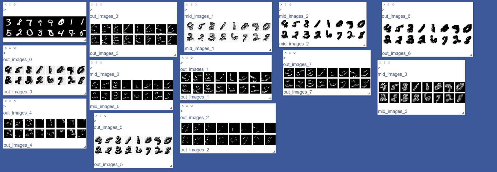

# MiniTorch Module 4


* Docs: https://minitorch.github.io/

* Overview: https://minitorch.github.io/module4.html

This module requires `fast_ops.py`, `cuda_ops.py`, `scalar.py`, `tensor_functions.py`, `tensor_data.py`, `tensor_ops.py`, `operators.py`, `module.py`, and `autodiff.py` from Module 3.


Additionally you will need to install and download the MNist library.

(On Mac, this may require installing the `wget` command)

```
pip install python-mnist
mnist_get_data.sh
```


* Tests:

```
python run_tests.py
```
#### Figure for Task 4.5:

#### Hidden States Visual

Epoch  0  example  0  loss  36.9764976532833  accuracy  0.125

Epoch  0  example  800  loss  1795.8179986170624  accuracy  0.525

Epoch  0  example  1600  loss  1360.938827105502  accuracy  0.6875

Epoch  0  example  2400  loss  895.1772655130908  accuracy  0.7375

Epoch  0  example  3200  loss  789.8513501521246  accuracy  0.7375

Epoch  0  example  4000  loss  742.8584487335949  accuracy  0.775

Epoch  0  example  4800  loss  684.5394152253056  accuracy  0.75

Epoch  1  example  0  loss  8.981052504836299  accuracy  0.8125

Epoch  1  example  800  loss  612.8244351932955  accuracy  0.825

Epoch  1  example  1600  loss  600.2322362423312  accuracy  0.7875

Epoch  1  example  2400  loss  412.1398267057508  accuracy  0.8

Epoch  1  example  3200  loss  416.18718685959635  accuracy  0.775

Epoch  1  example  4000  loss  410.8074989691818  accuracy  0.8375

Epoch  1  example  4800  loss  397.71360130456605  accuracy  0.775

Epoch  2  example  0  loss  3.435068598244032  accuracy  0.8375

Epoch  2  example  800  loss  353.5742145713405  accuracy  0.8625

Epoch  2  example  1600  loss  373.7163757239692  accuracy  0.8125

Epoch  2  example  2400  loss  246.6608276856134  accuracy  0.8125

Epoch  2  example  3200  loss  259.89392295924284  accuracy  0.8625

Epoch  2  example  4000  loss  310.67669715447414  accuracy  0.8625

Epoch  2  example  4800  loss  288.6847006255473  accuracy  0.8375

Epoch  3  example  0  loss  2.9175799579499597  accuracy  0.875

Epoch  3  example  800  loss  256.9562344965526  accuracy  0.875

Epoch  3  example  1600  loss  317.23508066579495  accuracy  0.8375

Epoch  3  example  2400  loss  214.24877963745757  accuracy  0.825

Epoch  3  example  3200  loss  226.57341242478046  accuracy  0.8625

Epoch  3  example  4000  loss  251.7968644161945  accuracy  0.875

Epoch  3  example  4800  loss  236.26295555905025  accuracy  0.85

Epoch  4  example  0  loss  1.6057580793430186  accuracy  0.875

Epoch  4  example  800  loss  197.26026699334085  accuracy  0.9

Epoch  4  example  1600  loss  280.37083282727167  accuracy  0.825

Epoch  4  example  2400  loss  184.5545758326175  accuracy  0.85

Epoch  4  example  3200  loss  183.15226443071137  accuracy  0.8625

Epoch  4  example  4000  loss  206.02378226198937  accuracy  0.875

Epoch  4  example  4800  loss  175.35111138929892  accuracy  0.8625

Epoch  5  example  0  loss  2.7138618855079573  accuracy  0.875

Epoch  5  example  800  loss  184.76753737734398  accuracy  0.8625

Epoch  5  example  1600  loss  253.2285886982843  accuracy  0.85

Epoch  5  example  2400  loss  148.825045346433  accuracy  0.8375

Epoch  5  example  3200  loss  149.95501877072442  accuracy  0.875

Epoch  5  example  4000  loss  213.0492833516202  accuracy  0.8625

Epoch  5  example  4800  loss  170.6511508182271  accuracy  0.85
